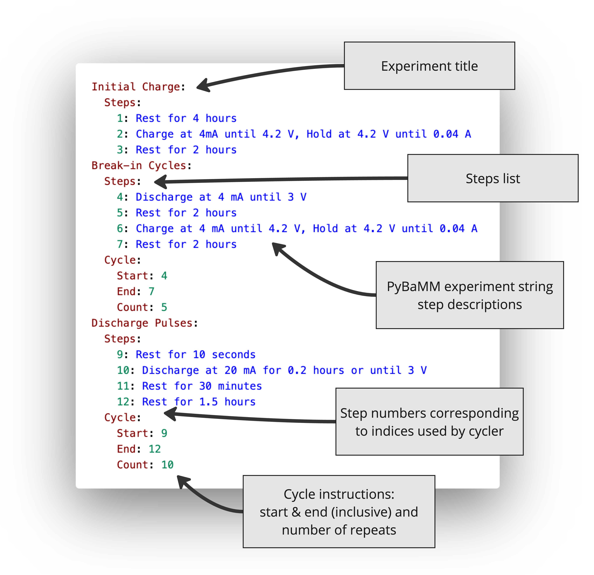

# PyProBE
PyProBE (Python Processing for Battery Experiments) is a Python package designed to simplify and accelerate the process of analysing data from 
battery cyclers.

PyProBE is documented [here](https://imperialcollegelondon.github.io/PyProBE/). Examples are stored in ```docs/source/examples``` and are integrated into the documentation [here](https://imperialcollegelondon.github.io/PyProBE/examples/examples.html).

## Installing PyProBE
Please follow the [user installation guide](https://imperialcollegelondon.github.io/PyProBE/user_guide/installation.html) to install PyProBE.

## PyProBE Objectives
<details open>
<summary><strong style="font-size: 1.2em;">1. Ease of use</strong></summary>
        
PyProBE breaks down complex battery data into simple, easy to understand objects 
that can be accessed with a few lines of code using natural language. The 
procedure shown below:


can be filtered into the experiments that make up the procedure:

```python
cell.procedure['Reference Test'].experiment('Initial Charge')
cell.procedure['Reference Test'].experiment('Discharge Pulses')
```
And filtered by cycle, step or step type:

```python
cell.procedure['Reference Test'].step(1)
cell.procedure['Reference Test'].experiment('Discharge Pulses').cycle(3).discharge(0)
```

This makes it easy to quickly access the data you need for analysis. See the [filtering data](https://imperialcollegelondon.github.io/PyProBE/examples/filtering-data.html) example to see this in action.

See the [documentation](https://imperialcollegelondon.github.io/PyProBE/) for a detailed user guide. Start with the following pages to get PyProBE set up with your data:
- [Importing data](https://imperialcollegelondon.github.io/PyProBE/user_guide/importing_data.html)
- [Accessing data](https://imperialcollegelondon.github.io/PyProBE/user_guide/accessing_data.html)
- [Plotting](https://imperialcollegelondon.github.io/PyProBE/user_guide/plotting.html)

PyProBE works with numerous cyclers. For guidance on how to export your data to work with PyProBE see the [Input Data Guidance](https://imperialcollegelondon.github.io/PyProBE/user_guide/input_data_guidance.html).
</details>

<details>
<summary><strong style="font-size: 1.2em;">2. Accelerate battery data exploration</strong></summary>

PyProBE has a built-in [plotting](https://imperialcollegelondon.github.io/PyProBE/api/pyprobe.plot.html) module for fast and flexible visualisation of battery data. It also includes a graphical user interface (GUI) 
for exploring data interactively, with almost no code. Run the 
[getting started](./docs/source/examples/getting-started.ipynb) example locally to try the GUI.


PyProBE is fast! Built on [Polars](https://docs.pola.rs/) dataframes, PyProBE 
out-performs manual filtering with Pandas and stores data efficiently in Parquet files:


</details>

<details>
<summary><strong style="font-size: 1.2em;">3. Encourage data processing aligned with FAIR principles</strong></summary>

PyProBE is designed to encourage good practice for storing and processing data PyProBE 
requires a README file to sit alongside your experimental data which is:
    
**Human readable:** Sits alongside your data to allow others to quickly understand your experimental
procedure.

**Computer readable:** Simplifies the PyProBE backend, maximises flexibility to different input data and
makes the setup process fast and intuitive for new data.



See the [guidance](https://imperialcollegelondon.github.io/PyProBE/user_guide/writing_a_readme_file.html) for writing README files for your
experiments.
</details>

<details>
<summary>4. <strong style="font-size: 1.2em;">Host a library of analysis methods</strong></summary>

PyProBE's [analysis](https://imperialcollegelondon.github.io/PyProBE/api/pyprobe.analysis.html) module contains classes and methods to
perform further analysis of battery data. It is designed to maintain compatibility 
with the PyProBE data format and plotting tools while ensuring functions are simply 
defined, portable and tested.

The currently implemented analysis methods includes:

- Summarise pulsing experiments with resistance information from each pulse
- Summarise cycling experiments with SOH quantification for each cycle
- Differentiation of any quantity
    - Finite-difference based method
    - Level Evaluation ANalysis method
- Data smoothing
    - Level-based method
    - Spline fitting
    - Savitzky-Golay filtering
- Degradation mode analysis
    - Curve fitting to pseudo-OCV, Incremental Capacity Analysis (ICA) or Differential Voltage Analysis (DVA) curves
    - Charge/discharge pseudo-OCV curve averaging for resistance compensation

It is easy to contribute to the analysis module. See the [developer guide](https://imperialcollegelondon.github.io/PyProBE/developer_guide/contributing_to_the_analysis_module.html)
and [contributing guidelines](CONTRIBUTING.md).
</details>

## Contributing to PyProBE

Contributions to PyProBE are welcome. Please see the [contributing guidelines](CONTRIBUTING.md).

## Citing PyProBE

TBC


## License

PyProBE is fully open source. For more information about its license, see [LICENSE](LICENSE.md).


## Contributors
<!-- readme: contributors -start -->
<table>
<tr>
    <td align="center">
        <a href="https://github.com/tomjholland">
            
            <br />
            <sub><b>Tom Holland</b></sub>
        </a>
    </td></tr>
</table>
<!-- readme: contributors -end -->
